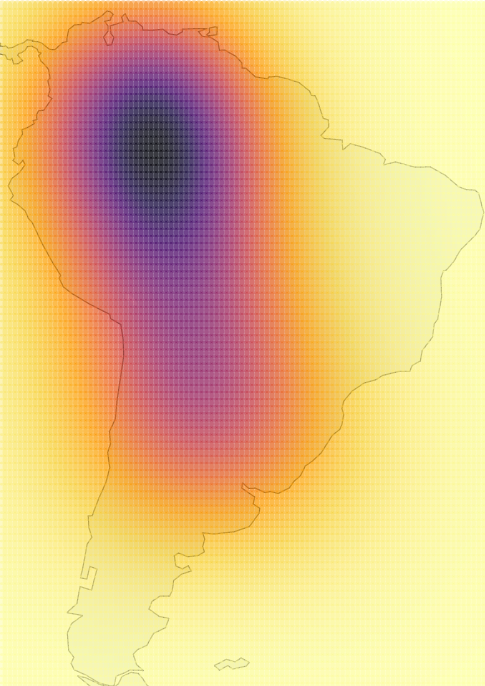

# Tweets Geolocation
### Technical Report 

#### Task description

The task and the dataset were published by Inca Digital as Challenge #68. 
The task was to predict coordinates of a tweet given its text and some meta-information.
The data provided contains approx. 4.5G of textual data in CSV format with geotagged tweets from South America.
The reported result is an average divergence of predicted coordinates from true ones in kilometers (computed 
using Vincenty's distance formula).

#### Model description

The model is a rather straightforward implementation of a UnicodeCNN architecture from (Izbicki et al. Geolocating 
Tweets... 2019), done in PyTorch from scratch. Some adjustments of the initial architecture were introduced
in order to take advantage of the properties of the dataset. 

The model is a character-level CNN-based classifier, trained in a multi-task regime for:

  * language prediction (66 languages supported by Twitter API, out of which 53 are present in the dataset)
  * country prediction (supporting 18 countries present are in the dataset)
  * city prediction (5000 most populated cities in South America according to Simplemaps World Cities Database)

Language and country prediction were used to achieve effects of regularization for a CNN backbone, which is hard 
to train using only an MvMF loss. We do not provide an evaluation of their performance in this challenge. However, 
their results might be useful for other downstream tasks, or can be used separately from the geolocation task using 
the same model presented here.

The city prediction task is performed by calculating weights of a mixture of von Mises-Fisher distributions (MvMF)
with mean directions set to the coordinates of cities in South America, which are not modified during training. 

The final prediction of a geolocation of a tweet is taken to be the location of the city ranked highest 
in the city prediction task. Although approximate, this result demonstrates a good compromise between computational 
cost and accuracy compared to a grid search approach, which is computationally prohibitive.

#### Data preparation

As a classifier, the model proved highly susceptible to the class imbalance present in the dataset. To mitigate that,
at least to some extent, the dataset was under-sampled to contain at most 10k samples from any given location. No 
data cleaning was attempted. For the training dataset, samples were shuffled and written to files of size 10k samples.
Thus, the final training dataset contained approx. 3.5M entries. A small portion of samples was held out for evaluation
and was not used for training.     

#### Training procedure

We fitted the model in a multi-task regime with a combined loss in the form of a weighted sum of losses for individual 
tasks with weights 0.1 for language and country prediction tasks and 1.0 for a MvMF loss. We used an Adam optimizer 
with learning rate 10e-4 and L2 regularization implemented with a PyTorch optimizer's weight decay 10e-5.
Additionally, gradient clipping with max norm 4.0 was done. Unicode encoding was done in parallel on CPU and 
optimization was performed on GPU. Hyperparameter fine-tuning was done manually, we report the best performing model.
We trained with batches of size 1000 for 8 epochs using an 8-core Intel i7-3770 box (16Gb RAM, SSD) with 
GeForce 1050Ti 4Gb, which took approx. 36 hours. 

#### Evaluation results

Evaluation on a held-out dataset containing 10k samples resulted in MAE 1586.01 km, which is in line 
with the performance of the UnicodeCNN (Small) variant reported in (Izbicki et al., Geolocating Tweets... 2019).  

#### References

1. Izbicki et al. Geolocating Tweets in any Language at any Location. 2019. 
2. Izbicki et al. Exploiting the Earth's Spherical Geometry to Geolocate Images. 2019.
3. World Cities Database, https://simplemaps.com/data/world-cities
4. Inca Digital Challenge, https://github.com/inca-digital/challenge/issues/68